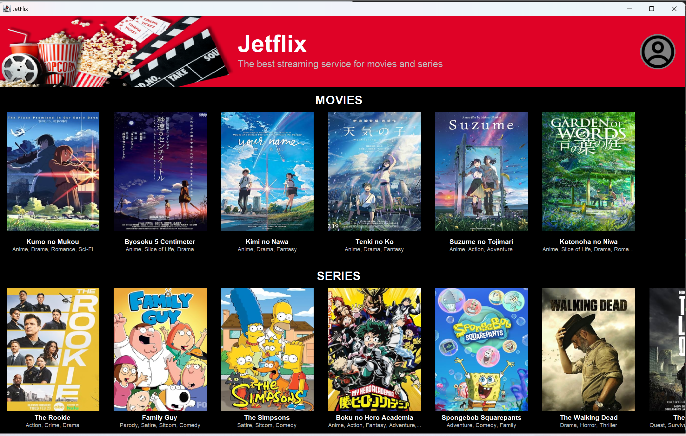
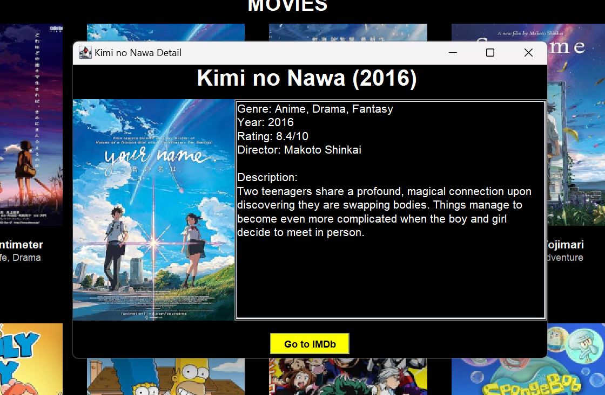
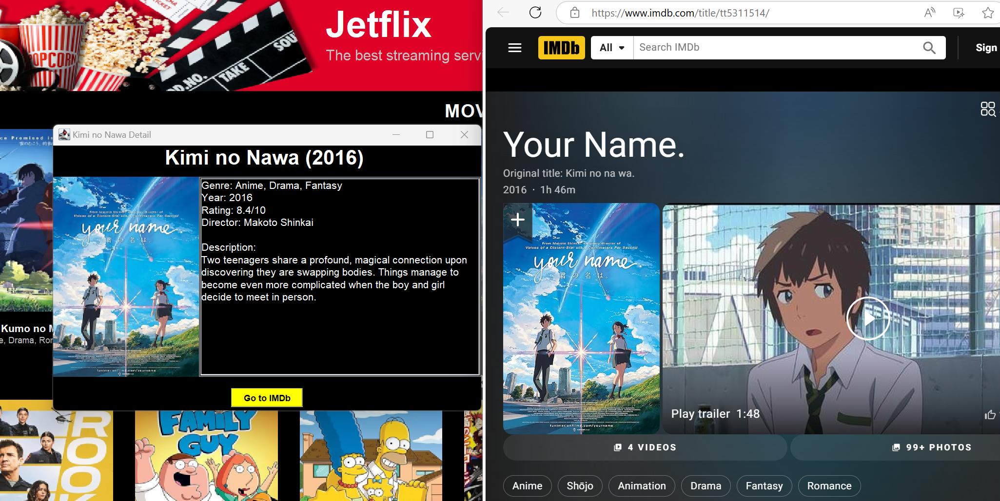
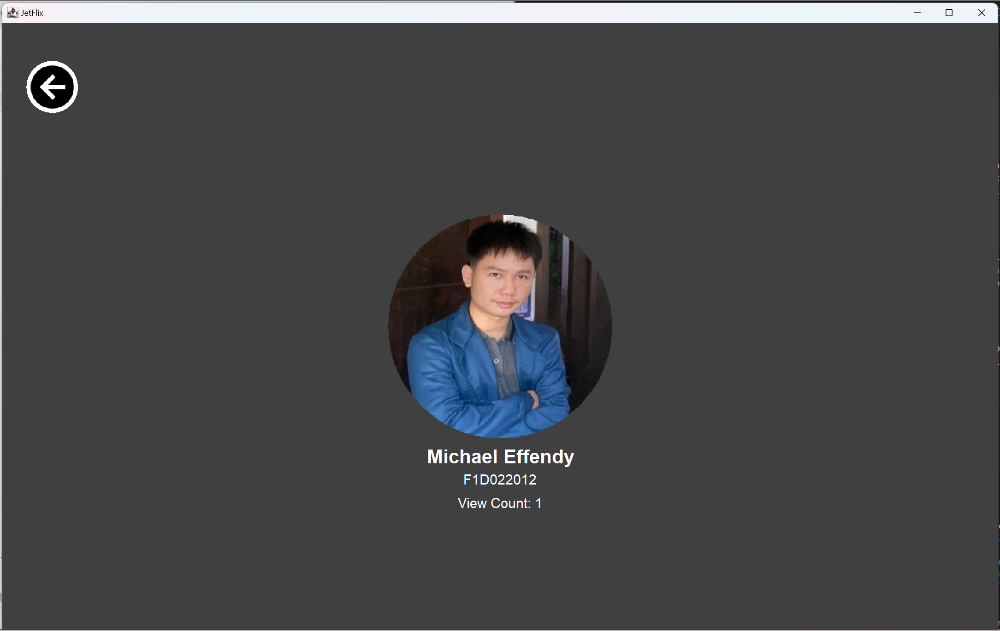

[](https://classroom.github.com/a/2E6y6Jk9)
# Modul 3: Graphical User Interface (GUI)

## Deskripsi

Modul ini mengeksplorasi penggunaan **AWT** dan **Swing** dalam pemrograman berorientasi objek (OOP) menggunakan Java. Proyek ini terdiri dari berbagai jenis class komponen atomik GUI yang saling terkait membentuk suatu program GUI.

## Konsep Utama

### 1. Penggunaan JFrame

`JFrame` di sini digunakan untuk membuat frame atau kontainer utama dari sebuah program GUI. Dalam program ini, ada 2 buah frame yang dibuat, yaitu frame utama (Jetflix) dan frame detail movie/series. Frame utama adalah frame parent, yang ketika ditutup akan menutup frame-frame lainnya (`EXIT_ON_CLOSE`), sementara itu frame detail movie/series adalah subframe, yang ketika ditutup tidak akan menutup frame utama (`DISPOSE_ON_CLOSE`).

### 2. Penggunaan CardLayout

Karena dalam frame utama kita dapat berpindah antara daftar movies/series ke halaman profil tanpa menambah frame atau berganti frame, maka kita perlu menggunakan `CardLayout`, layout dengan jenis ini dapat menampilkan salah satu dari beberapa panel di satu waktu, prinsipnya seperti tumpukan kartu. Perpindahan panel dilakukan dengan menekan tombol profil di halaman daftar movies/series dan tombol back di halaman profil.

### 3. Penggunaan JPanel

`JPanel` dalam program GUI ini digunakan untuk menampung berbagai komponen-komponen GUI lainnya, misalnya `JLabel`, `JList`, atau `JButton`, dll. `JPanel` juga dapat menampung `JPanel` lainnya. `JPanel` dapat diberikan Layout Manager seperti `BorderLayout`, `CardLayout`, `BoxLayout`, `FlowLayout`, ataupun layout lainnya.

### 4. Penggunaan JList

Dalam program ini, `JList` digunakan untuk menyimpan data-data movies/series yang ingin ditampilkan. Awalnya data disimpan dalam sebuah `ArrayList`, kemudian diconvert ke dalam `JList`. Dalam `JList` diperlukan renderer untuk menampilkan isinya satu per satu, isi dari `JList` dapat ditampilkan dengan bantuan `JScrollPane` (agar bisa scrolling) yang dalam kasus ini dibuat secara horizontal dan jumlah baris maksimal 1. Penggunaan `JList` lebih tepat daripada `panel` dengan `FlowLayout` karena jika kita menggunakan `FlowLayout`, ketika daftar movies/series sudah melebihi `frame`, movies tersebut akan bergeser ke baris baru, bukannya tersembunyi di baris sampai discroll oleh user seperti halnya menggunakan `JList`.  

### 5. Mengatur Path Gambar

Dalam program ini, gambar dapat diletakkan di dalam folder `assets`. Untuk mengaksesnya, jika kode diletakkan di direktori yang sama dengan folder `assets`, maka cukup dengan `"./assets/..."`. Misalnya kita ingin mengakses gambar `Kimi no Nawa.jpg` yang ada di folder `assets/movie`, maka pathnya adalah `"./assets/movie/Kimi no Nawa.jpg"`.

### 6. Penggunaan Class Movie

Dalam program ini, class `Movie` digunakan untuk menyimpan atribut-atribut dari movies/series, yaitu `title`, `genre`, `year`, `director`, `rating`, `description`, `icon`, dan `imdbID`.

### 7. Penggunaan Mouse Listener

Dalam program ini, `MouseListener` digunakan ketika user menekan salah satu movies atau series untuk melihat detailnya. Contoh penggunaannya adalah sebagai berikut:
```
SeriesJList.addMouseListener(new MouseAdapter() {
            @Override
            public void mouseClicked(MouseEvent e) {
                int idx = SeriesJList.locationToIndex(e.getPoint());
                if (idx >= 0 && idx < SeriesJList.getModel().getSize()) {
                    Movie selectedMovie = SeriesJList.getModel().getElementAt(idx);
                    new DetailFrame(selectedMovie).setVisible(true);
                }
            }
        });
```

Pada kode di atas, ketika mouse diklik 1x, maka lokasi dari mouse akan dicari (pada indeks ke berapa dalam `JList`), kemudian jika indeks >=0 dan tidak melebihi isi dari `Jlist`, maka kita mengambil detail dari movies/series tersebut, dan menampilkan `frame` baru yang berisi detailnya. Di sini tidak menggunakan `keyword extends MouseAdapter` di classnya karena menggunakan `inner class`.

### 8. Penggunaan ActionListener

Dalam program ini, `ActionListener` digunakan ketika user menekan suatu button, misalnya ketika menekan tombol `backBtn`, maka aksi yang akan dilakukan adalah berpindah ke `cardPanel` bernama `"main"` . Contoh implementasi kodenya:
```
backBtn.addActionListener(e -> cardLayout.show(cardPanel, "main"));
```

### 9. Penggunaan class ImagePanel

Class `ImagePanel` adalah class yang saya buat sendiri mengextends `JPanel`, class ini digunakan untuk membuat objek `ImagePanel` (mirip `JPanel`), tetapi dapat menggunakan image sebagai backgroundnya memanfaatkan method `paintComponent` yang dioverride.

### 10. Pemberian Background pada Button

Dalam program ini, saya memberikan background berbentuk bulat pada button profil dan button back. Hal tersebut dilakukan dengan mengoverride method `paintComponent` bawaan `JButton`, saya mengatur warna background ketika button ditekan dengan `getModel().isArmed()`. Cara mengatur warnanya dengan `g.setColor(Color.GRAY)`. Kemudian `g.fillOval` dipanggil dengan parameter `(posisi X, posisi Y, ukuran X, ukuran Y)`.

### 11. Membuat Foto Profil Menjadi Bulat

Dalam program ini, di panel profil, foto profilnya dapat dibuat menjadi bulat dengan menggunakan `Ellipse2D.Double`. Awalnya image diload terlebih dahulu sebagai `Image`, kemudian dikonversi menjadi `BufferedImage` dan `Graphics2D`. Saat di `Graphics2D (g2d)`, diatur clippingnya agar bisa menjadi bulat, kemudian digambar dengan `g2d.drawImage`.

### 12. View Count yang Dinamis

Dalam program ini, di panel profil, view countnya bersifat dinamis, akan bertambah 1 ketika tombol profil ditekan. Hal ini dapat dilakukan dengan membuat satu variabel `static int viewCount`, diberi default value 0. Kemudian di `ActionListener` dari button ke profil ditambahkan seperti ini: 
```
profileBtn.addActionListener(e -> {
            cardLayout.show(cardPanel, "profil");
            viewCount++;
            viewCountLabel.setText("View Count: " + viewCount);
            isiProfil.revalidate();
            isiProfil.repaint();
        });
```

Jadi pada kode di atas, `viewCount` bertambah 1 setiap kali button ditekan dan `viewCount` yang ada di panel profil akan diupdate.

### 13. Hyperlink Menuju Website imdB

Dalam program ini, ketika button di detail movies/series ditekan, maka akan langsung membuka browser dan membuka halaman dari movies/series tersebut di imdB. Kode yang bertugas untuk hal tersebut adalah: `Desktop.getDesktop().browse(new URI("https://www.imdb.com/title/" + movie.getImdbID()));` di mana program akan membuka browser untuk link url yang ada di `URI`, yaitu "https://www.imdb.com/title/IDFilmnya". ID filmnya disimpan di dalam objek class `Movie`.

---

## Gambar Hasil Run



Gambar di atas adalah tampilan daftar movies/series yang ada di dalam aplikasi Jetflix, dapat dilihat karena menggunakan JList, ketika daftar film melebihi ukuran frame, maka sisa film akan tersembunyi sampai discroll oleh user.



Gambar di atas adalah tampilan detail dari movies/series yang menampilkan judul, genre, tahun, rating, director, deskripsi, gambar poster, dan button untuk menuju ke website imdb untuk movies/series itu.



Gambar di atas adalah tampilan ketika tombol Go to IMDb ditekan, yaitu membuka browser dan langsung menuju ke page dari movies/series tersebut.



Gambar di atas adalah tampilan ketika tombol profil di header ditekan, maka akan masuk ke halaman profil, yang berisi foto, nama, nim, dan viewCount, di mana viewCount ini dinamis.

---